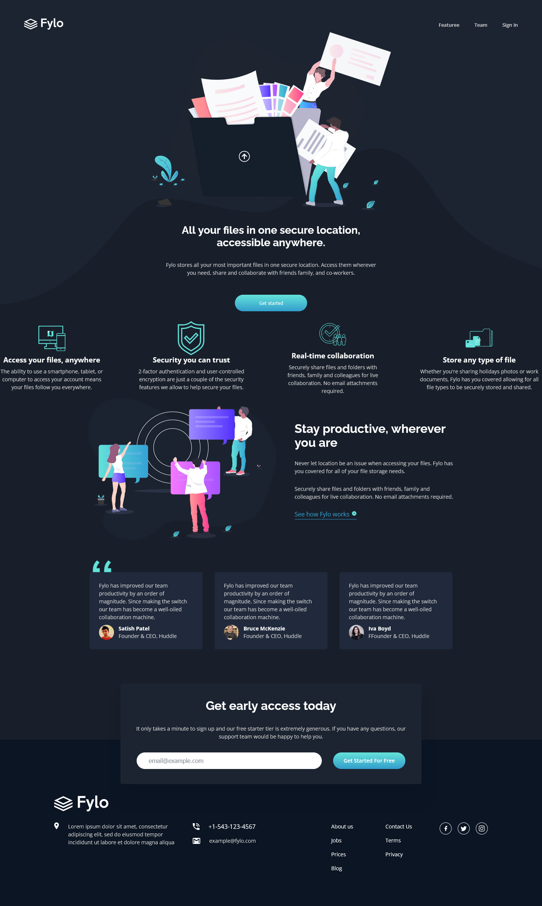
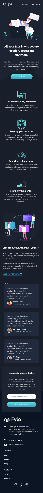

# Frontend Mentor - Fylo dark theme landing page solution

This is a solution to the [Fylo dark theme landing page challenge on Frontend Mentor](https://www.frontendmentor.io/challenges/fylo-dark-theme-landing-page-5ca5f2d21e82137ec91a50fd). Frontend Mentor challenges help you improve your coding skills by building realistic projects. 

## Table of contents

-   [Overview](#overview)
  - [The challenge](#the-challenge)
  - [Screenshot](#screenshot)
  - [Links](#links)
  - [Built with](#built-with)
  - [What I learned](#what-i-learned)
  - [Useful resources](#useful-resources)
  - [Author](#author)


## Overview
This is the front end mentor challenge recreation of Fylo dark theme landing page solution I did following my other frontend mentor code challenges

### The challenge

Users should be able to:

- View the optimal layout for the interface depending on their device's screen size
- See hover and focus states for all interactive elements on the page

### Screenshot




### Links

- Solution URL: [Add solution URL here](https://your-solution-url.com)
- Live Site URL: [Add live site URL here](https://your-live-site-url.com)

## My process

### Built with

- Semantic HTML5 markup
- CSS custom properties
- Flexbox
- CSS Grid
- vscode

### What I learned

I learned and practiced a great deal of flex property in this challenge for positioning
I learnt a how to use svg in my code to manipulate images

### Code I'm Proud of

```html
<h1>Some HTML code I'm proud of</h1>
<div class="profile-container">
  
  <div class="profile-details">
    <h4 class="profile-name">Satish Patel</h4>
    <p class="profile-title content">Founder & CEO, Huddle</p>
  </div>
</div>
```
```css
.proud-of-this-css {
  color: papayawhip;
}

.sign-in-wrapper {
  position: absolute;
  top: 90%;
  left: 50%;
  transform: translate(-50%, -50%);
  display: flex;
  align-items: center;
  justify-content: center;
  flex-flow: column;
  gap: 2rem;
  padding: 40px;
  background: var(--Dark-Blue-1);
  width: 800px;
  border-radius: 5px;
  box-shadow: 5px 40px 30px 2px hsla(216, 53%, 9%, 0.3);
}

```

### Useful resources

- [unicon icons ](https://iconscout.com/unicons) - This helped me for icons.
- [google fonts](https://fonts.google.com/) - This helped me for fonts i used in this challenge.
- [Font Awesome](https://fontawesome.com/)
- [IcoMoon](https://icomoon.io/)

## Author

- Website - [Qaphael Opiyo](https://qaphael-portfolio-website.web.app/)
- Frontend Mentor - [@Qaphael](https://www.frontendmentor.io/profile/Qaphael)
- Twitter - [@laflo_lr](https://twitter.com/Laflo_lr)
- Github - [@Qaphael](https://github.com/Qaphael)

